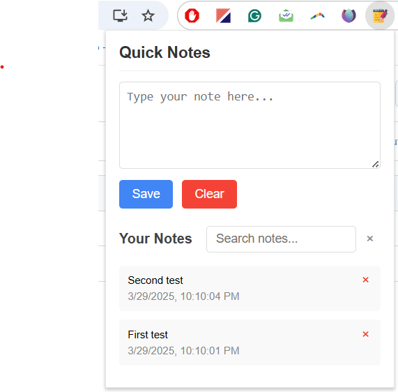

# Quick-Notes
Chrome extension to jot down notes

A lightweight and user-friendly Chrome extension for taking, searching, and managing notes directly from your browser.



## Features

- ✏️ **Quick Note Taking**: Capture thoughts and ideas instantly without leaving your browser
- 🔍 **Real-time Search**: Filter notes as you type with highlighted search results
- 💾 **Automatic Saving**: Notes are synced across your Chrome browsers
- 🗑️ **Easy Management**: Delete unwanted notes with a single click
- 📱 **Responsive Design**: Clean interface that works on any screen size

### Manual Installation (Developer Mode)
1. Download or clone this repository
2. Open Chrome and navigate to `chrome://extensions/`
3. Enable "Developer mode" in the top-right corner
4. Click "Load unpacked" and select the extension directory
5. The Quick Notes icon will appear in your Chrome toolbar

## Usage

### Taking Notes
1. Click the Quick Notes icon in your browser toolbar
2. Type your note in the text area
3. Click "Save" to store your note

### Searching Notes
1. Enter search terms in the search box
2. Notes containing your search terms will be displayed with the matches highlighted
3. Click the "×" button to clear your search

### Deleting Notes
- Click the "×" button in the top-right corner of any note to delete it

## Project Structure

```
quick-notes-extension/
├── manifest.json         # Extension configuration
├── popup/
│   ├── popup.html        # Extension popup interface
│   ├── popup.css         # Styling for the popup
│   └── popup.js          # Core functionality
└── assets/
    └── icon.png          # Extension icon
```

## Technical Details

- Built with vanilla JavaScript, HTML, and CSS
- Uses Chrome's Storage Sync API to save notes across devices
- Implements real-time search with regex-based highlighting
- Follows Chrome Extension Manifest V3 guidelines

## Future Enhancements

- [ ] Note categories or tags
- [ ] Markdown support
- [ ] Import/export functionality
- [ ] Custom themes
- [ ] Auto-save feature
- [ ] Context menu integration


## Acknowledgments

- Icons provided by [Flaticon]

---

## Support

If you encounter any problems or have any suggestions, please [open an issue](https://github.com/yourusername/quick-notes-extension/issues) on GitHub.
